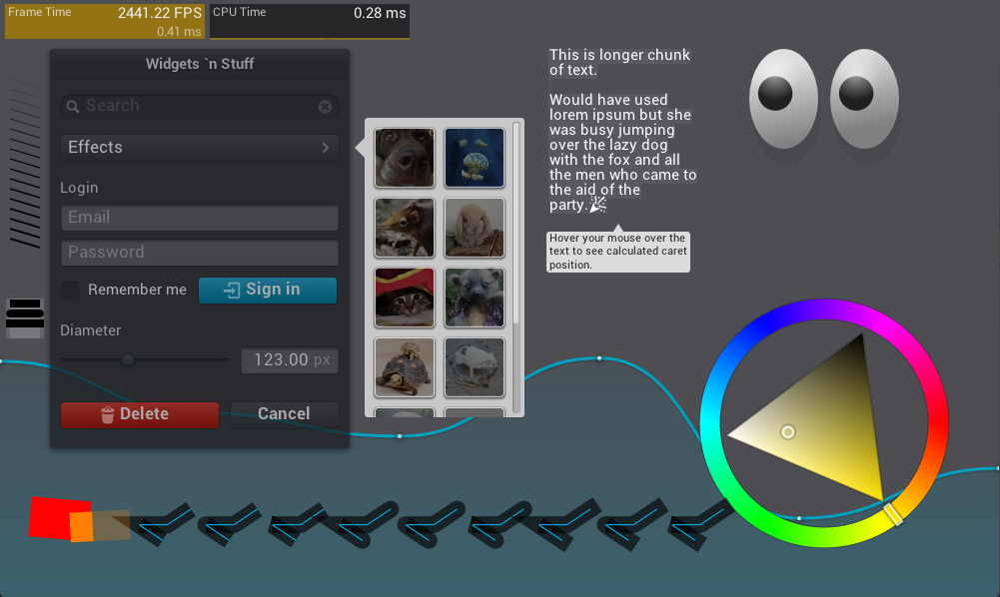

# LibNanoVG

Julia bindings for the [NanoVG](https://github.com/memononen/nanovg) drawing library.

> NanoVG is small antialiased vector graphics rendering library for OpenGL. 
> It has lean API modeled after HTML5 canvas API. It is aimed to be a practical and fun toolset for building scalable user interfaces and visualizations.



This package only provides the raw bindings generated by Clang.jl. 
If you want a more *julian/high-level* package, see [NanoVG.jl](https://github.com/dylanxyz/NanoVG.jl).

## Installation

LibNanoVG is a &nbsp;
    <a href="https://julialang.org">
        
        Julia Language
    </a>
    &nbsp; package. To install LibNanoVG,
    <a href="https://docs.julialang.org/en/v1/manual/getting-started/">open
    Julia's interactive session (known as REPL)</a> and press <kbd>]</kbd> key in the REPL to use the package mode, then type the following command:
</p>

```shell
pkg> add LibNanoVG
```

## License

This package is licensed under the [MIT](LICENSE) license.

NanoVG is licensed under the [zlib license](https://github.com/memononen/nanovg/blob/master/LICENSE.txt).
