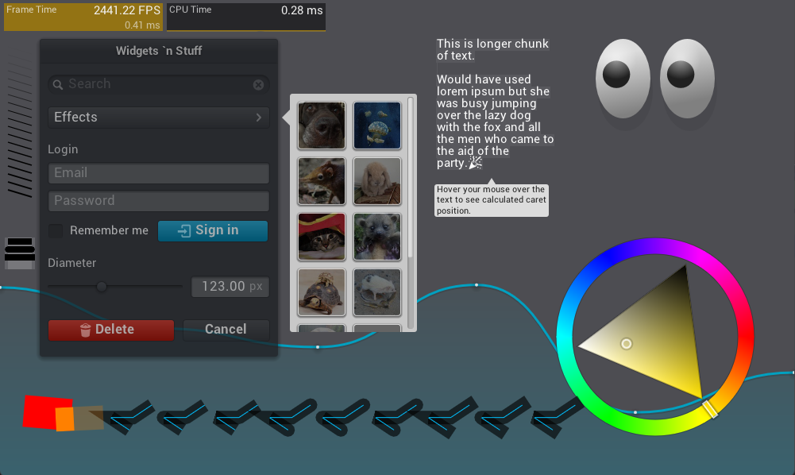

# NanoVG

Julia bindings for the [NanoVG](https://github.com/memononen/nanovg) drawing library.

> NanoVG is small antialiased vector graphics rendering library for OpenGL. 
> It has lean API modeled after HTML5 canvas API. It is aimed to be a practical and fun toolset for building scalable user interfaces and visualizations.

## Screenshot

The screenshot was made with the julia implementation of the
NanoVG [demo](examples/demo.jl) example.



## Installation

NanoVG is a &nbsp;
    <a href="https://julialang.org">
        
        Julia Language
    </a>
    &nbsp; package. To install NanoVG,
    <a href="https://docs.julialang.org/en/v1/manual/getting-started/">open
    Julia's interactive session (known as REPL)</a> and press <kbd>]</kbd> key in the REPL to use the package mode, then type the following command:
</p>

```shell
pkg> add https://github.com/dylanxyz/NanoVG.jl
```

> Note that NanoVG is not yet at the public registry,
> installation is done directly from this repo.

## Documentation

In progress...

## Basic Example

```julia
using GLFW
using NanoVG
using ModernGL

function main()
   title = "NanoVG Basic Example"
   width = 800
   height = 600

   window = GLFW.CreateWindow(width, height, title)
   @assert window != C_NULL "Could not create a GLFW window 😢"

   GLFW.MakeContextCurrent(window)

   # Create the NanoVG context with the GL3 implementation
   NanoVG.create(NanoVG.GL3, antialiasing=true)

   while true
      if GLFW.WindowShouldClose(window) break end
      # get the framebuffer size
      width, height = GLFW.GetFramebufferSize(window)
      # get the window size
      winWidth, winHeight = GLFW.GetWindowSize(window)
      # dpr = device pixel ratio
      dpr = width / winWidth
      # set the viewport
      glViewport(0, 0, width, height)
      # create a new frame
      NanoVG.frame(winWidth, winHeight, dpr)
      # drawing functions should be called here
      
      # set the fill color
      fillcolor(rgb(128, 32, 56))
      # draw a filled circle at the center of the screen
      circle(width/2, height/2, 128, :fill)

      # render the frame to the screen
      NanoVG.render()

      GLFW.SwapBuffers(window)
      GLFW.PollEvents()
   end

   NanoVG.dispose()
   GLFW.DestroyWindow(window)
end

main()
```

## License

This package is licensed under the [MIT](LICENSE) license.

NanoVG is licensed under the [zlib license](https://github.com/memononen/nanovg/blob/master/LICENSE.txt).

Additional licenses for [assets](examples/assets):

- Roboto is licensed under the [Apache License](https://www.apache.org/licenses/LICENSE-2.0)
- Entypo licensed under CC BY-SA 4.0.
- Noto Emoji licensed under [SIL Open Font License, Version 1.1](http://scripts.sil.org/cms/scripts/page.php?site_id=nrsi&id=OFL)
